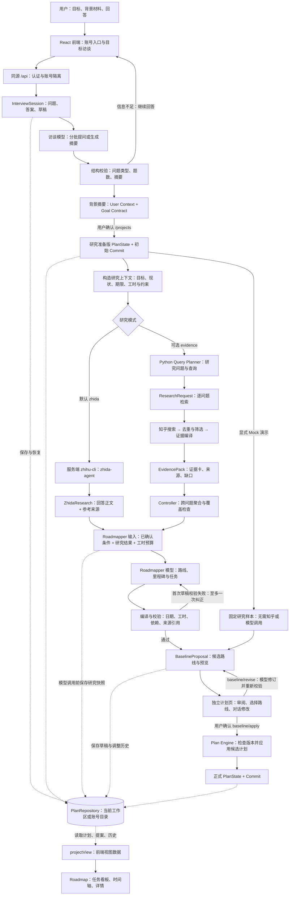
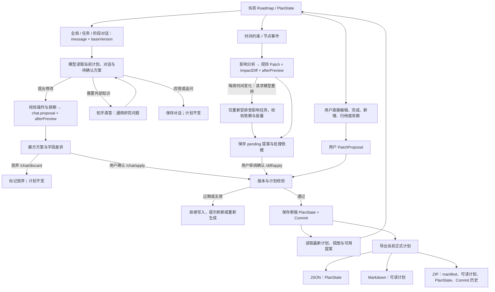
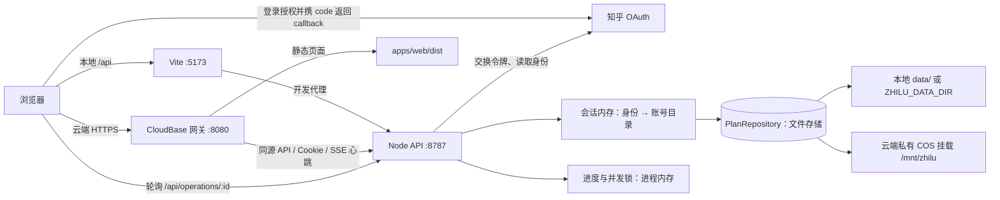

# 知路（Zhilu）

知乎知识驱动的目标规划 Agent：从目标和背景出发，研究可行路径，生成可审阅的计划，再在可编辑 Roadmap 中持续执行和调整。支持任意目标；“成为 Agent 工程师”只是仓库自带的演示案例。

例如，用户希望在八周内完成一个作品集：先回答当前能力、每周时间和交付要求，确认背景摘要；系统研究路线并生成任务草稿，用户在独立计划页修改和确认；进入 Roadmap 后可以完成任务、直接改期，或提出“本周只能投入两小时”，审阅调整方案后再保存。

> 本文按 2026-09-15 的仓库实现整理。代码能力、离线回归与线上验收分开说明；PRD 和旧交接文档中的计划不代表功能已经完成。

## 当前实现

| 环节 | 已有代码能力 | 使用边界 |
| --- | --- | --- |
| 账号与目标管理 | 知乎 OAuth、退出登录、“我的目标”、账号历史、继续未完成访谈 | 无 OAuth 配置的开发环境使用本地工作区；生产环境要求登录 |
| 背景访谈 | 导入 Markdown/TXT；模型按目标分批提问；每批 1–5 题，总计最多 30 题；支持单选、多选、程度选择、有限填空和跳过 | 访谈需要模型配置；回答与草稿保存在服务端，生成失败可继续 |
| 背景确认 | 展示并确认 User Context Card（用户现状与限制）和 Goal Contract（目标、期限与成功标准） | 确认后先建立“研究准备版”项目，尚未生成正式任务路线 |
| 研究与计划 | 默认知乎直答 + Roadmapper 模型；可选 Python 证据检索；生成候选路线、里程碑、任务、交付物与完成标准 | 草稿与 Roadmap 分页；先校验和审阅，再确认应用 |
| 草稿调整 | 独立计划页对话修改、路线选择、前后差异、调整历史 | `/baseline/revise` 只替换待确认草稿；确认应用不重新调用模型 |
| Roadmap | 同日任务分组看板、任务连接线、底部连续日历时间轴；编辑、完成、新增、归档、按周拖动改期 | 详情面板统一保存，保护未保存输入；支持移动端与减少动态效果 |
| 执行中调整 | 全局、任务、阶段入口共用计划对话；按需查询知乎；生成待确认方案 | 入口上下文供模型参考，不是服务端强制限定范围；以差异预览为准 |
| 时间约束事件 | 影响分析、规则预览、模型局部排期、用户确认、处理依据记录 | 模型事件重排针对每周时间变化；其他事件不等于已实现自动研究和重规划 |
| 保存与导出 | 文件持久化、计划版本、变更记录、JSON / Markdown / `.planbundle.zip` | 当前为单实例文件存储；ZIP 包含正式计划与 Commit，不是账号所有数据的备份 |

前端集成与交互记录见 [前端集成说明](docs/frontend-visual-2026-09-15/INTEGRATION.md) 和 [交互更新](docs/frontend-visual-2026-09-15/INTERACTION-UPDATE.md)。

## 完整数据流

### 1. 从目标输入到正式计划

实线表示业务数据流，虚线表示存储或恢复。图中的 **Commit** 是应用内的计划变更记录，与 Git 提交无关；**BaselineProposal** 是候选计划，**PlanState** 是当前保存的计划状态。



**两条研究链路的区别：**

- **默认 `zhida`**：开启真实调用后，Node 服务通过知乎 CLI 获取直答正文及参考来源，再交给 Roadmapper 安排任务。不依赖 Python 研究环境。来源整理摘要不是已核验的 EvidenceCard；没有来源链接也可生成计划。当前前端尚未展示直答正文和专门的引用卡片。
- **可选 `evidence`**：设置 `ZHIHU_RESEARCH_MODE=evidence`，运行 Query Planner → 多个 ResearchRequest → Python 检索与证据编译 → 聚合检查 → Roadmapper。当前网页的 live Baseline 入口使用 `allow_insufficient`：有效但不足的证据或部分结果可生成明确标注的暂定草稿，不自动追加补检索。Controller 的严格模式另保留一轮补检索能力，不是该网页入口的默认策略。
- **Mock**：显式选择固定演示样本，或直接打开自带 Roadmap；真实调用失败不会静默变成 Mock 成功。

访谈模型会接收目标、背景材料与累计回答；研究链路使用从已确认计划构造的上下文。模型凭据和知乎凭据留在服务端。检索失败、模型超时或最终校验不通过时返回错误，保留已提交回答与已有草稿，不将失败结果写入正式任务路线。

### 2. 执行、调整、确认与导出

**PatchProposal** 是一组结构化修改操作，带有生成时的 `baseVersion`；**ImpactDiff** 表示事件影响范围和前后差异。直接编辑来自用户明确操作，AI 方案则保留在待确认状态。



AI 修改受操作白名单、版本检查和手工字段保护约束；对话方案不能覆盖已完成或归档的任务。模型不会直接写文件。时间约束入口的模型重排不调用知乎；知识型调整通过计划对话按需研究。当前没有所有事件都可自动处理的通用闭环。

### 3. 认证、网络与存储



OAuth 只用于获取身份和隔离账号数据；身份读取后丢弃 OAuth access token。知乎研究使用服务端 CLI 自己的凭据，不借用登录用户的 OAuth token。云端写请求的 SSE 心跳用于维持长连接，和研究接口的原生 SSE 是两条独立机制。

## 存储内容与恢复边界

默认根目录为 `data/`，可用 `ZHILU_DATA_DIR` 覆盖。启用 OAuth 时，下列结构放在 `data/accounts/<账号哈希>/`；本地工作区直接使用 `data/`。

```text
<工作区或账号目录>/
├── interviews/<访谈 ID>.json             # 问题、回答、未提交草稿、进度、关联项目
├── diagnostics/interviews/...           # 私有访谈诊断
└── <项目 ID>/.plan/
    ├── plan.json                        # 当前保存的 PlanState
    ├── commits/<Commit ID>.json          # 计划变更记录
    ├── baseline-proposals/<ID>.json      # 待确认候选计划
    ├── planning-history/<ID>.json        # 确认前的计划调整对话
    ├── pending/<Patch ID>.json           # 待确认事件修改与影响预览
    ├── chat.json                        # 执行阶段对话与方案状态
    ├── research-snapshots/<Run ID>.json  # 私有研究输入快照，供 M3 回放
    ├── research-partials/...            # 部分研究失败产物（如有）
    └── research-failure.json            # 最近一次 Controller 失败诊断（如有）
```

访谈和计划可在服务重启后恢复；OAuth 会话、运行进度和并发锁存在内存中，重启后需重新登录，进行中的生成任务不会自动续跑。文件采用临时文件 + rename 写入，但多文件保存不是数据库事务。当前部署按单实例、单可写版本运行。

ZIP 导出只打包正式计划与 Commit，不包含访谈原始回答、未确认提案、聊天全量记录或私有研究诊断；其中正式计划和 Commit 本身仍可能包含用户背景与研究信息。

## 仓库结构与代码入口

| 路径 | 职责 / 关键入口 |
| --- | --- |
| [`apps/web`](apps/web) | React 19 + Vite；`AccountApp.tsx` 账号，`Onboarding.tsx` 访谈，`App.tsx` 计划工作区，`RoadmapBoard.tsx` 看板，`RoadmapChat.tsx` 对话 |
| [`apps/server`](apps/server) | TypeScript / Node HTTP API；`index.ts` 路由，`auth.ts` 认证，`repository.ts` 存储，`interview.ts` 访谈，`roadmap-chat.ts` 调整 |
| [`packages/contracts`](packages/contracts) | PlanState、InterviewSession、EvidencePack、BaselineProposal、Patch 等共享数据契约 |
| [`packages/plan-engine`](packages/plan-engine) | 确定性校验、影响分析、Patch 应用、Commit 和视图生成 |
| [`packages/agent-runtime`](packages/agent-runtime) | Workflow Controller、研究结果聚合、Roadmapper 输入与编译、事件重排 |
| [`packages/zhihu`](packages/zhihu) | 可选 Python 研究链路：Query Planner、检索、筛选、证据编译、缓存与评测 |
| [`deploy/cloudbase`](deploy/cloudbase) | 单容器启动、静态资源/API 网关、SSE 心跳与部署说明 |
| [`examples`](examples) / [`docs`](docs) | 演示 Plan Bundle、设计决定、测试与交接记录 |

关键 API：`/api/interviews` 管理访谈；`/api/projects` 建立研究准备版；项目下 `/research/live/baseline` 生成草稿、`/baseline/revise` 修订、`/baseline/apply` 确认；`/nodes` 直接编辑；`/chat`、`/chat/apply`、`/chat/discard` 管理执行中对话；`/events`、`/diff/replan`、`/diff/apply` 管理事件预览与应用；`/export/json|markdown|zip` 导出。路由与 HTTP 方法以 [`apps/server/src/index.ts`](apps/server/src/index.ts) 为准。

## 本地运行

CloudBase 测试部署见 [部署说明](deploy/cloudbase/README.md)。线上环境与本地运行分别配置；合并或推送 Git 不会自动部署云服务。

以下命令均从**仓库根目录**执行。需要 Node.js 24 和 pnpm 10.30.2；首次拉取代码后安装依赖：

```bash
node --version
pnpm --version
pnpm install
```

如果没有 pnpm，可先执行 `npm install -g pnpm@10.30.2`。

### 1. 准备后端配置

首次运行时，将 `apps/server/.env.example` 复制为 `apps/server/.env.local`；已有文件时保留原配置，不要覆盖。在 macOS / Linux 下可执行：

```bash
test -f apps/server/.env.local || cp apps/server/.env.example apps/server/.env.local
```

- **只看演示 Roadmap**：无需模型、Python 或知乎凭据，保持 `ZHIHU_LIVE_ENABLED=false`。
- **测试目标访谈、生成背景问题**：填写 `ROADMAP_API_KEY`、`ROADMAP_API_URL` 和 `ROADMAP_MODEL`。URL 必须是完整的 Chat Completions 地址；没有模型配置时，访谈会提示错误，不回退固定题库。
- **测试直答与计划生成**：另外配置 `ZHIHU_LIVE_ENABLED=true`，准备已登录的知乎 CLI；默认使用 `zhida-agent`，可用 `ZHIDA_TIMEOUT_MS` 调整客户端等待上限（默认 95000 毫秒）。模型配置见 [后端模型配置](apps/server/README.md#roadmapper-模型配置)。
- **使用可选 `evidence` 链路或单问题证据 API**：还需准备 Python 依赖，以及本机绝对路径 `ZHIHU_PYTHON_BIN` 和 `ZHIHU_PYTHON_CWD`；生成计划时切换 `ZHIHU_RESEARCH_MODE=evidence`。配置方式见 [知乎模块配置](packages/zhihu/README.md#p0-server-真实证据接入)。Python 的 `packages/zhihu/.env` 与 Node 配置分开。

CLI 路径优先读取 `ZHIHU_CLI_BIN`，其次是 `ZHIHU_CLI_PATH`；Windows 自动查找当前用户安装目录，其余情况使用 PATH 中的 `zhihu-cli`。保留本机路径，不要复制其他系统的绝对路径。密钥只放本地环境文件，不写入 `VITE_*` 或提交 Git。

### 2. 启动后端（终端一）

显式加载后端环境文件，并监听代码变化：

```bash
node --env-file=apps/server/.env.local --watch --import tsx apps/server/src/index.ts
```

后端地址为 `http://127.0.0.1:8787`。修改 `.env.local` 后，需在该终端按 `Ctrl+C`，重新运行启动命令。

**已配置 OAuth、但还没有公网回调时**：任何非空 OAuth 配置都会要求登录，`ZHILU_AUTH_MODE=local` 单独设置不能覆盖它。只测试本地访谈与 Roadmap 时，用下面的命令替代上面的后端启动命令（macOS / Linux）；它仅对当前进程清空 OAuth 配置，保留文件中的凭据和模型配置：

```bash
NODE_ENV=development ZHILU_AUTH_MODE=local \
ZHIHU_OAUTH_APP_ID= ZHIHU_OAUTH_APP_KEY= ZHIHU_OAUTH_REDIRECT_URI= \
node --env-file=apps/server/.env.local --watch --import tsx apps/server/src/index.ts
```

真实 OAuth 登录需部署后配置已登记的公网 HTTPS 回调地址，路径为 `/api/auth/callback`；本地预览不等于授权联调通过。

### 3. 启动前端（终端二）

在另一个终端进入同一仓库根目录，执行：

```bash
pnpm --filter @zhilu/web dev
```

打开 `http://127.0.0.1:5173`。前端通过 Vite 将 `/api` 请求代理到 `127.0.0.1:8787`，无需给前端配置后端密钥。

- 目标访谈：`http://127.0.0.1:5173/?page=interview`
- 无模型演示：`http://127.0.0.1:5173/?project=agent-engineer-demo&page=roadmap`（本地工作区模式）
- 后端健康检查：`http://127.0.0.1:8787/api/health`，正常返回 `{"ok":true}`。
- 登录配置检查：`http://127.0.0.1:8787/api/auth/status`，可查看当前模式和缺失配置，不返回密钥。

首次打开演示项目会初始化本地 `data/`。访谈、答案和计划历史保存在后端数据目录；重启不会删除这些记录。开启 OAuth 后，账号数据与原本地工作区分开。

### 快捷启动与排查

只需无配置演示，或已在终端设置好环境变量时，也可用 `pnpm dev` 同时启动前后端。**当前 `pnpm dev` 和 `pnpm --filter @zhilu/server dev` 不会自动读取 `apps/server/.env.local`**；需要模型配置时，优先使用上面的双终端方式。

- 页面打不开：检查前端终端实际显示的地址；5173 被占用时 Vite 可能改用其他端口。
- 页面提示网络错误或代理连接失败：检查后端是否启动，以及 `/api/health` 是否正常。
- 提示缺少模型配置：确认后端使用了 `--env-file`，并在修改配置后重启。
- 提示知乎登录缺少回调：本地测试使用上面的临时关闭 OAuth 命令。
- 后端提示 `EADDRINUSE`：已有进程占用 8787，先在原终端停止旧服务；不要重复启动多个后端。

结束开发时，在前后端各自终端按 `Ctrl+C`。

## 验证

从仓库根目录运行。跨语言测试需要 Python；即使日常只用直答模式，完整测试仍需准备它。macOS / Linux 可使用 Python 3.11+ 建立测试环境：

```bash
python3.11 -m venv .venv
.venv/bin/python -m pip install -r packages/zhihu/requirements-dotenv.txt httpx pytest
pnpm typecheck
ZHIHU_TEST_PYTHON_BIN="$PWD/.venv/bin/python" pnpm test
pnpm build
node --test deploy/cloudbase/gateway.test.mjs
(cd packages/zhihu && ../../.venv/bin/python -B -m pytest -q)
```

已有 `.venv` 时复用现有环境。`ZHIHU_TEST_PYTHON_BIN` 是测试专用解释器覆盖项；部分测试的默认路径为 Windows `.venv/Scripts/python.exe`，在 macOS / Linux 裸跑 `pnpm test` 会因此失败。Windows 的安装、一键离线回归和 HTTP 联调见 [本地后端测试](docs/LOCAL_BACKEND_TESTING.md)。上述命令不读取个人环境文件来发起真实模型或知乎调用。

### 当前验证与待验收项

- 本次合并检查（2026-09-15）：全仓类型检查与生产构建通过；TypeScript 测试 725 项通过（前端 101、Server 440、Agent Runtime 178、Plan Engine 6）；Python 离线测试 1,077 项通过；CloudBase 网关测试 1 项通过。类型检查、构建、离线测试分别验证代码与协议，不证明真实生成质量。
- 仓库中的前端浏览器验收记录使用隔离样本与模拟接口；覆盖桌面、平板、手机、拖动改期、访谈恢复、方案确认和过期拒绝，详见 [前端集成记录](docs/frontend-visual-2026-09-15/INTEGRATION.md)。
- [2026-09-15 部署交接记录](deploy/cloudbase/README.md#2026-09-15-交接状态) 记载测试服务已部署且真实 OAuth 登录通过；这是已有验收记录，本次合并未重新部署或复验线上状态。
- 云端仍需验证超过 60 秒的真实生成、完整计划保存、重新部署后恢复、跨账号隔离，以及这次前端更新后的完整流程。直答正文与引用展示、所有事件的自动研究/重排、多实例运行不在当前完成范围。

更多说明：[Server 与模型配置](apps/server/README.md)、[知乎模块](packages/zhihu/README.md)、[部署手册](deploy/cloudbase/README.md)、[核心实现决定](docs/core-implementation-decisions.md)、[团队与模块边界](docs/team-and-repo-plan.md)。
