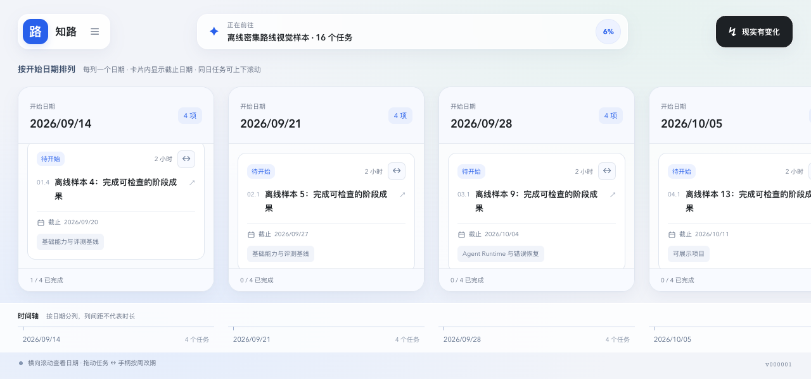

# Dogfood 修复与复验（上一阶段历史记录）

> **2026-09-15 范围更新：当前交付以 [前端升级与验证记录](UI-REVISION-2.md) 为准。用户最新要求仅修改前端。本文提到的 DF-04 服务端补丁、`/api/capabilities` 及其前端配置探测已撤回；真实研究诊断已停止。以下旧截图和完整链路测试描述历史版本，不代表当前服务端已修复或已验收。**

日期：2026-09-14。分支：`codex/frontend-visual-copy`。

先按要求将首轮视觉重构和原始报告保存为本地 commit **`0d3049a` — `feat(web): refresh visual design and add roadmap timeline`**。没有 push。本报告描述的是随后完成、当前仍在工作区的修复。

**历史阶段曾实施 DF-01 至 DF-10 的对应改动；当前仅保留前端修复。DF-04 的服务端处理和 DF-10 的配置探测不再包含在工作区。当前同日分组、连线、输入框、文案和验证结果均以新报告为准。**

## 同一天是一张长卡片

任务按现有 `startDate` 从左到右分列，同一天的所有任务放进同一张卡片。多个任务的列占满窗口扣除顶部工具区、底部时间轴、提示区与间距后的可用高度，任务列表单独上下滚动；单任务列保持紧凑。所有未归档任务都会参与分组，包括没有里程碑的任务。

日期列之间使用原生横向滚动，不再受固定平移范围限制。底部时间轴同步滚动，也可以点击日期或目标定位。原有按周改期规则通过独立的 `↔` 手柄保留：鼠标左右拖动，或聚焦后按左右方向键。拖动列头只改变视野。

列头明确标出“开始日期”，每项任务显示“截止日期”；时间轴说明列间距不代表时长。历史缺失日期显示“待安排”，不推断补写。编辑任务时要求有效起止日期，开始不得晚于截止；日期仍由原 API 和 Engine 校验。

## 原始问题关闭记录

| 问题 | 修复 | 复验 |
| --- | --- | --- |
| DF-01 窄屏到不了末端 | 日期列替换曲线画布，原生横向滚动，底部轴同步，可回到起点 | Chrome / WebKit 四组尺寸均能到达目标，无固定平移上限 |
| DF-02 隐藏抽屉与弹层焦点 | 关闭时移除内容；使用原生 modal dialog、焦点循环与归还；嵌套 Escape 只关闭当前层 | 两种浏览器验证 Tab、Escape、脏表单继续编辑与放弃；WebKit 复验期间发现的 Escape 冒泡和焦点归还问题也已修复 |
| DF-03 原生 prompt 不可用 | 新增应用内名称表单，取消、空白校验、忙碌状态和错误反馈 | 空白不能提交；取消不改版本；有效名称仅创建一次；进入详情继续编辑 |
| DF-04 完成后无法记录变化 | 服务端补丁已撤回；当前仅保留前端友好提示与失败输入保留 | 原保护规则保持不变；不能引用本报告的历史结果声称当前服务端已修复 |
| DF-05 远期任务被称作本周任务 | 保留任务选择规则，未来回退集合显示“后续任务” | 完成近期任务后的浏览器检查及固定日期单测通过 |
| DF-06 状态与其他字段保存时机不同 | 名称、日期、状态统一草稿，一次保存；只提交变更字段；未保存关闭需确认 | 两种浏览器验证状态选择不提前写入、联合保存刷新、取消与放弃草稿 |
| DF-07 确认动作太远 | 摘要和候选页底部操作区 sticky；风险、依据及演示告知保留 | 390×844 首屏确认区域可见；按钮下沿均不超过 826px |
| DF-08 开始与截止含义不清 | 开始日期作为列头，任务显示截止；说明等宽日期列不代表等长时段 | 看板、详情、时间轴交叉检查，无日期值变更 |
| DF-09 历史仅五条 | 增加查看全部版本 / 收起入口，复用完整历史 | 页面版本数等于 API 历史数，早期基线可见；ZIP 也含全部历史 |
| DF-10 术语与配置错误不易理解 | 演示 / 未验证状态使用中文解释；导出显示实际格式；开始前检查配置；友好错误与可展开技术详情 | 研究未开启时提前说明并禁止无效调用；保留演示路径；已知未配置时禁止 AI 重排并解释仍可确认时间约束；错误映射单测通过 |

这些结论是代码和操作层面的复验，不代表已证明首次使用者一定理解所有文案。理解程度需要真实参与者验证。

## 覆盖与证据

继续使用隔离的 `5178 → 8797` 前端 / API 和 `/tmp/zhilu-visual-dogfood-data`。访谈混合题型通过原有注入接口提供固定样本，演示路线沿用 Mock 流程。`dense-visual` 是 16 项任务、4 个日期的合成数据；没有将它的证据标签当作真实研究结果。新建的 `project-39e7d158` 用于导入、访谈、确认、改期和导出，原先的 `project-e6cc7fcf` 用于保护字段事件与历史回归。

| 验证项 | 结果 / 证据 |
| --- | --- |
| Computer Use 原生 Chrome | 列内滚动到最后一项、任务详情和脏表单操作、点击时间轴到达目标；[列内滚动截图](fixes-evidence/chrome-native-column-scroll.png)、[时间轴末端截图](fixes-evidence/chrome-native-timeline-goal.png) |
| Chrome 与 WebKit 布局矩阵 | 1280×720、1280×600、768×1024、390×844：4 列 16 任务，无重叠；多任务列高度等于可用高度；最后一项和目标可达；轴同步；Tab 循环和 Escape 通过。[Chrome](fixes-evidence/chrome-matrix-result.json)、[WebKit](fixes-evidence/webkit-matrix-result.json) |
| 日期、状态、草稿 | Chrome 实际鼠标拖动后从 09/15–09/17 变为 09/22–09/24，刷新持久化；键盘按周改期另行通过。Chrome / WebKit 日期输入 / 保存 / 刷新、嵌套取消和放弃通过。[拖动结果](fixes-evidence/drag-export-result.json)、[Chrome 编辑结果](fixes-evidence/chrome-edit-result.json)、[WebKit 编辑结果](fixes-evidence/webkit-edit-result.json) |
| 背景与确认流程 | 实际导入 Markdown 并核对全文；单选、多选、程度按钮、文本四题提交；长摘要确认；研究入口；演示候选；确认后生成路线。页面切换回顶部。[流程结果](fixes-evidence/onboarding-result.json)、[摘要](fixes-evidence/chrome-mobile-summary.png)、[候选确认](fixes-evidence/chrome-mobile-plan-confirmation.png) |
| 保护字段事件 | 手动完成后记录变化、刷新恢复预览、用户确认，所有节点保持不变且事件入历史。[预览截图](fixes-evidence/chrome-event-record.png)、服务端针对性测试 |
| 实际导出内容 | 点击 JSON / Markdown / ZIP 并下载；JSON 等于正式计划，Markdown 含目标和全部任务；ZIP 内计划与 Markdown 等于单独下载，manifest 对应当前版本，包含 5 个完整历史文件。[内容核对](fixes-evidence/download-content-result.json) |

下载核对对应测试项目 v5，之后的跨浏览器日期编辑继续生成新版本；下载内容无需等于后续版本。

WebKit 是 Playwright 官方浏览器运行时，不等于在 Safari 应用或 iPhone 上的实际验证。窄窗口也不等于物理触屏设备。首次测试脚本的按钮文字匹配、下载 Buffer 用法和过早读取滚动事件等工具问题已纠正，不作为产品缺陷统计。浏览器原生滚动后的绘制存在异步过程，断言等待滚动状态同步。

本轮执行过的浏览器断言保存在 [scripts](fixes-evidence/scripts/)。这些是审计与复现材料，依赖本报告所列的临时项目、注入访谈数据、初始版本和 5178 服务，并会修改测试项目；不能直接当作在任意用户项目上可安全重复运行的脚本。

## 代码范围与验证

前端新增日期分组看板、可访问弹层、编辑草稿差异和配置状态组件，并修改相关页面、文案和样式。补充站点图标，消除页面 favicon 404。

以下为已撤回的历史改动：根据当时“全部解决”的授权，服务端曾为 DF-04 增加受保护原因的独立事件记录路径，以及返回四个配置布尔值的只读 `/api/capabilities`。该接口不返回密钥、路径或服务地址，也不发起上游调用；配置存在不代表调用健康。没有修改 contracts、plan-engine、agent-runtime 或 Python 研究实现，也没有改变字段保护和证据验证规则。用户确认仍是正式计划写入边界。

| 命令 | 结果 |
| --- | --- |
| `pnpm typecheck` | 工作区通过，[输出](fixes-evidence/typecheck.txt) |
| `ZHIHU_TEST_PYTHON_BIN="$PWD/.venv/bin/python" pnpm test` | 42 个测试文件，607 项通过：Engine 6、Agent Runtime 168、Web 78、Server 355。[输出](fixes-evidence/tests-configured.txt) |
| `pnpm build` | 工作区通过，[输出](fixes-evidence/build.txt) |
| 最终弹窗修复后的 Web 检查 | [类型检查](fixes-evidence/final-web-typecheck.txt)、[78 项测试](fixes-evidence/final-web-tests.txt)、[构建](fixes-evidence/final-web-build.txt) 通过，并进行 Chrome / WebKit 嵌套弹窗回归 |
| `git diff --check` | 通过 |

第一次直接 `pnpm test` 时，两个既有跨语言测试采用 Windows 默认解释器路径而失败；设置仓库已有的 `ZHIHU_TEST_PYTHON_BIN` 为本机虚拟环境后全部通过。未为此修改产品配置。Python 实现没有改动，本轮没有重跑完整 Python 测试集。

## 仍未通过的真实链路与后续验收

V-01、V-02、V-03 已在上述桌面浏览器和固定窗口矩阵内完成验证。V-05 的创建、归档、文件导入及三种导出内容已补齐；物理触屏与完整设备矩阵仍待验证。

V-04 使用现有真实配置和独立数据目录 `/tmp/zhilu-live-dogfood-fixes`，目标是虚构的个人笔记网页，不含用户身份或私人材料。实际结果如下：

1. **真实访谈通过**：25 题，7 次模型请求，完成摘要并创建研究准备版 `project-d23edba4`。约 51 秒。[原始状态记录](fixes-evidence/live-results.json)
2. 首次研究约 7.6 秒返回 `invalid_plan_output`，未发起检索。
3. 第二次约 38.9 秒：规划通过，实际发起 3 次搜索；首个问题返回 7 条通过校验的证据，第二个问题发生 `compilation_failed`。完整研究未完成，不能据此声称 M3 候选质量通过。[第二次记录](fixes-evidence/live-retry-results.json)
4. 随后的有界重试约 0.6 秒返回 `llm_error`，本次未开始检索。[重试记录](fixes-evidence/live-final-attempt.json)

随后用仓库已有的固定 JSON 最小模型连通性检查定位环境差异：继承代理时 [连接失败](fixes-evidence/model-connectivity.txt)，仅在单个测试进程不继承代理变量后，[直连](fixes-evidence/model-direct-connectivity.txt) 和 [实际配置的 Python 子进程](fixes-evidence/model-child-connectivity.txt) 均成功。独立真实 [研究规划诊断](fixes-evidence/planner-connectivity-result.json) 也通过。系统代理与项目配置没有改动。

长期运行的隔离 API 仍曾返回 [模型调用失败](fixes-evidence/live-direct-results.json)，因此又在同一临时进程里启动 API 并验证整个请求。最终这次约 **8 秒**：规划通过，实际发起 2 次搜索，但首个问题的证据编译返回 `compilation_failed`。[完整状态](fixes-evidence/live-integrated-results.json)。它说明失败不能全部归因为代理；证据编译拒绝仍待定位，尚无足够诊断证明具体是哪个字段或上游返回导致。临时 API 随该请求结束而关闭。

没有放宽校验、采用被拒绝内容或伪造成功路线。研究准备版仍为 **v1、1 条历史，没有正式研究路线被应用**，[写入边界检查](fixes-evidence/live-write-boundary.json)。真实 M3 候选和 M4 成功重排尚未验证。

以下原后续计划已被最新“仅前端”要求取消，不再执行：为失败的真实证据编译采集安全的校验分类与调用计数，定位到具体拒绝边界，并保留现有证据校验。随后用该独立项目完成研究 → 检查来源与候选 → 确认正式计划 → 时间事件 → 重排预览 → 刷新恢复 → 确认版本的闭环；保留本报告的失败样本作为对照。不能用演示数据的通过替代这项验收。

物理设备验收清单：Safari macOS、iPhone Safari、Android Chrome；每种设备检查纵向列滚动、横向看板滚动、原生日期控件、虚拟键盘遮挡、弹窗返回、新增与保存，以及文件下载。

首次试用仍按原计划招募 5 位未使用过产品的人。给同一任务卡，要求独立完成目标 → 解释候选区别 → 找到下一任务及截止 → 修改每周时间 → 说明哪些变更尚未生效 → 确认并查版本。逐人记录是否完成、卡住位置、耗时、对演示 / 证据 / 起止日期 / 保存时机的解释和原话。当前没有参与者数据，不填写虚构成功率。
