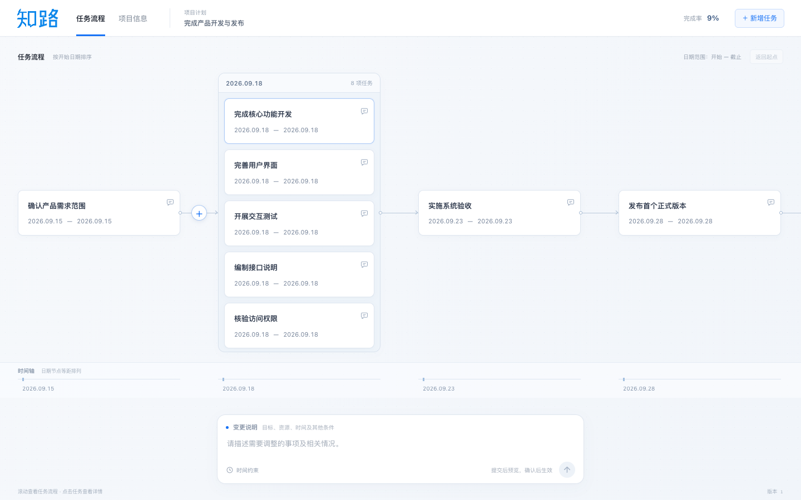
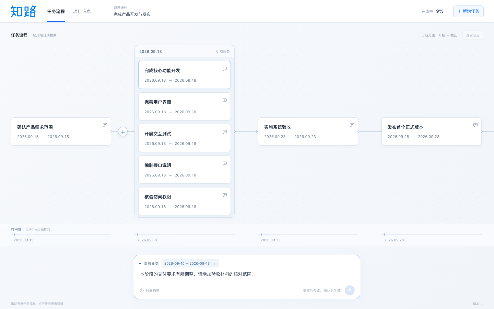

# 前端升级与验证记录

日期：2026-09-15。分支：`codex/frontend-visual-copy`。本地基线 commit：`0d3049a`，未 push。本次升级保留在工作区，尚未新增 commit。

本轮按最新要求仅修改前端，另更新走查文档与本地浏览器产物忽略规则。此前未提交的服务端改动已撤回，数据库、LLM API、知乎 API、契约、计划引擎及安全保护规则没有修改。[范围核对](ui-revision-evidence/scope.json)

## 审美总结与全部参考图的对应关系

这些参考体现的偏好是：专业工具界面、清晰的信息层级、细线和小型控件、轻量但有质感的白色表面。结合最新要求，知乎网页端的白底、蓝色品牌、深色标题与浅灰辅助信息成为主体系；淡彩和阴影只承担层次作用。深色时间轴参考采用其布局与连线方式，最终界面统一使用浅色。

| 参考 | 元素、配色与样式 | 本次采用 |
| --- | --- | --- |
| 原图 1 / 新图 2：网络流程工作台 | 点阵画布、精细连接、时间刻度、白色卡片；蓝、薄荷、粉色与淡紫环境色 | 点阵背景、连接端点、低对比层次和底部日期轴 |
| 原图 2：Lufga 字体与色板 | 几何无衬线；黑白主体，蓝色强调，绿 / 粉 / 橙辅助 | 系统无衬线与中文苹方回退；蓝色操作和克制的状态配色，没有引入外部字体 |
| 原图 3：CRM 客户旅程 | 分组容器、卡片式阶段、细连接、圆形操作、小面积状态色 | 同日任务聚合容器；组内独立滚动，减少分组标题占高 |
| 原图 4：数据节点编辑器 | 白底、窄边框、点阵、左右工具区和右侧属性面板 | 任务卡只显示必要字段，详细信息放在右栏 |
| 原图 5：引导式表单 | 集中填写区域、低干扰布局、单一蓝色主按钮 | 目标登记与访谈页面统一表单、主次按钮和提交层级 |
| 原图 6：调查编辑器 | 左导航、中央编辑、右评论；白色表面与淡蓝选中态 | 主工作区、侧栏、对话与选中态保持一致 |
| 原图 7：组件与统计面板 | 描边表单、蓝色选择、浅色卡片、专业数据层级 | 输入框、选择卡、弹窗、摘要和确认区统一边框与间距 |
| 新图 1：自动化流程编辑器 | 扁平横卡、细线连接、节点操作、连接处加号、右侧编辑 | 扁平任务卡、连线悬停圆形加号、卡片变更按钮 |
| 新图 3：深色 Timeline | 横向任务条、日期次序、细线依赖和稀疏高亮 | 日期顺序、横向连接和扁平比例；保持白色背景 |
| 新图 4：知乎 Logo | 蓝色定制中文字形 | 原图完整保存，通过 CSS 仅显示其中“知”；“路”使用标准字形转出的 SVG 轮廓，统一蓝色和光学字重 |
| 知乎网页端截图 | 白色通栏导航、蓝色下划线、浅灰页面、深色内容标题 | 白色导航与蓝色选中线、清晰标题、轻量工作区、白底蓝字知路标识 |

主要颜色为品牌蓝 `#0f88eb`、操作蓝 `#1772f6`、正文 `#202632`、工作区 `#f5f7fa`、边框 `#e4e9f0`。卡片圆角 9px，分组与侧栏 12px，输入框 15px；阴影较浅，避免厚重装饰。Logo 的“知”使用提供的原始图形；“路”已根据后续反馈更换为 PingFang SC Light 的标准字形轮廓，并以轻量描边校准光学字重；轮廓固化为 SVG，不依赖设备字体，也未引入字体文件。

## 已实现的界面

- 按现有**开始日期**从左到右排序，只有开始日期同一天的任务合并。相同截止日期但开始日期不同的任务保持独立；未设置日期的任务也各自保留，不合并、不补写日期。
- 单任务使用约 82px 高的扁平卡片；较长标题允许两行。卡片正文仅显示标题和起止日期，详情点击后在右侧栏查看。状态、工时、交付要求、验收标准及依据保留在详情中。
- 同日多任务看板占满画布可用高度，扣除顶部导航、操作提示、底部时间轴、输入框及间距。顶部日期栏为 35px，列表独立上下滚动。
- 不同日期之间以水平细线、端点和箭头连接；不再出现反复绕行。底部日期轴等距排列并同步横向滚动，可直接定位日期或项目目标。
- 原有按周拖动改期通过独立手柄保留，键盘左右键同样可用；点击卡片打开详情。

变更输入框固定在工作区底部中央，可描述目标、资源、时间、交付要求等任意情况。三个入口使用同一输入框：

| 入口 | 前端携带范围 | 行为 |
| --- | --- | --- |
| 底部输入框 | 全局；不附带任务 ID | 直接填写变更说明 |
| 连线悬停圆形加号 | 连线两端的任务集合 | 显示阶段范围并聚焦输入框；键盘聚焦和触屏也可显示按钮 |
| 卡片变更按钮 / 详情中的记录变更 | 当前任务 | 显示任务名称并聚焦输入框 |

范围标签可以清除。Enter 提交、Shift+Enter 换行，输入法组词时不触发提交。提交成功清空文字；失败保留文字并显示错误。变更预览使用独立右侧面板，仍需确认才会应用。

**能力边界：** 通用文字复用现有 `custom` 事件接口，时间约束仍复用原有结构化入口。本轮没有新增自然语言解析或自动重新排期能力；通用说明会按现有服务返回的结果展示预览，不能据此理解为任意文字都能自动调整日期。受保护字段仍由原服务拒绝不允许的覆盖，前端只解释错误并保留输入。

全部静态界面文案已改为正式的项目与任务用语，如“任务详情”“项目目标”“候选方案审阅”“记录任务变更”“交付要求与验收标准”。移除了“路标”“背包”“抵达”等拟人化表达，统一导航、空状态、提示、弹窗和错误说明。用户任务名称、原帖引用、既有历史及模型返回内容保持原数据，不进行改写。

页面覆盖：目标登记、混合题型访谈、背景摘要、研究入口、候选方案、计划调整对话、任务流程、项目侧栏、任务详情、新增 / 归档 / 放弃修改 / 时间约束弹窗、变更预览及加载 / 错误状态。[目标登记](ui-revision-evidence/chrome-onboarding-1440.png)、[候选方案](ui-revision-evidence/final-desktop-plan.png)、[任务详情](ui-revision-evidence/final-inspector.png)、[移动看板](ui-revision-evidence/final-mobile-board.png)、[移动摘要](ui-revision-evidence/chrome-summary-390.png)。

## Dogfood 与验证

本轮预览使用独立 Vite 静态样本，绑定 `127.0.0.1:5178`，业务代理被移除。保存与提交交互通过浏览器请求拦截提供固定返回，未访问项目数据库或调用模型 / 知乎服务。样本不是真实项目，测试结果仅证明前端行为。

实际使用 Computer Use 操作原生 Chrome：卡片变更入口、同日列表滚动到最后一项、打开右侧详情及由详情转入变更输入框。最终焦点实际落在“变更说明”文本区域。浏览器自动化另完成以下复验：

| 验证 | 结果与证据 |
| --- | --- |
| Chrome / WebKit 五种尺寸 | 1440×900、1280×720、1280×600、768×1024、390×844：同日合并、不同日独立、无重叠、看板高度等于可用空间、列表末项可达、目标可达、轴同步、输入框不遮挡时间轴。[Chrome](ui-revision-evidence/chrome-layout.json) / [WebKit](ui-revision-evidence/webkit-layout.json) |
| 三个变更入口 | 全局提交范围为空；卡片仅一个 ID；连线为相邻集合；失败文字保留，Shift+Enter 不提交，详情转入后焦点正确。[Chrome](ui-revision-evidence/chrome-interaction.json) / [WebKit](ui-revision-evidence/webkit-interaction.json) |
| 编辑与弹层 | 状态和名称统一保存，未保存时没有 PATCH；嵌套 Escape 仅退出当前层；取消保留草稿；完整历史、取消新增、空时间校验通过。记录见上方交互结果。 |
| 所有主要页面 | 两种浏览器的桌面与 390px 视口：目标、四种题型、摘要、研究入口、方案选择；摘要与方案确认区始终可达。[Chrome](ui-revision-evidence/chrome-pages.json) / [WebKit](ui-revision-evidence/webkit-pages.json) |
| 前端类型检查 | `pnpm --filter @zhilu/web typecheck` 通过，[输出](ui-revision-evidence/typecheck.txt) |
| 前端自动测试 | 11 个测试文件，80 项通过；包含缺失日期独立、同日分组、卡片信息边界、保存与预览回归。[输出](ui-revision-evidence/tests.txt) |
| 生产构建 | `pnpm --filter @zhilu/web build` 通过，[输出](ui-revision-evidence/build.txt) |
| 修改范围与格式 | 受保护目录无差异；`git diff --check` 通过。未 push，未新增服务调用。 |

本轮走查发现并已复验的前端问题：旧卡片外边距导致卡片仍偏高；详情关闭时焦点覆盖输入框的主动聚焦；侧栏底部操作区遮挡完整历史入口。对应采用移除残留边距、尊重主动焦点交接、侧栏 Flex 布局分离滚动区与操作区修正。

原始 DF-01 / 02 / 03 / 05 / 06 / 07 / 08 / 09 的前端修复已保留，DF-10 保留正式文案、演示状态和友好错误。**DF-04 的服务端事件处理及 DF-10 的新增配置探测已撤回**，相关原始问题仅作为历史记录，不宣称已完成后端修复。[原始 Dogfood](DOGFOOD.md) 与 [上一阶段记录](FIXES.md) 已标注这一边界。

## 后续前端提升计划

1. **真实设备复验，优先级 P1。** 在 iPhone Safari、Android Chrome 和 macOS Safari 检查软键盘弹出时的底部输入框、横纵向手势、触屏加号和原生日期选择。验收：输入内容、发送与关闭动作始终可达，同日列表和横向画布不会互相抢占滚动。
2. **首次使用者测试，优先级 P1。** 安排 5 位未使用过产品的参与者，独立辨认开始 / 截止日期、找到同日最后一个任务、通过三个入口分别提交变更并说明作用范围、检查预览及版本。记录完成情况、耗时和疑惑原话；目前没有参与者数据。
3. **高密度与长文案评估，优先级 P2。** 使用 100 / 300 任务、长标题、跨年日期及缩放窗口检查可读性和导航效率。根据真实操作结果评估任务搜索或日期定位增强，不在本轮新增业务能力。

这里的 WebKit 自动化不等同于 Safari 应用或真实手机验证。一次有限样本走查不能证明不存在其他问题；以上未执行项保留为后续计划。

复验脚本与静态样本存于 [ui-revision-evidence](ui-revision-evidence/)。脚本依赖报告所列本地路径与端口，仅用于隔离样本；不能直接指向实际项目服务运行。页面截图中的研究、任务和历史内容均为合成展示数据。

## Logo 字形修正（2026-09-15）

用户指出手绘“路”结构不正、字重不协调。本次用标准“路”字的字体轮廓替换手工拼接笔画，校准笔画粗细、字高和间距，保留原“知”图形与蓝色。主导航、侧栏和方案页分别统一为两字 36 / 26 / 30px，站点图标同步更新。浏览器检查三种尺寸均已加载，类型检查和构建通过。

[修正后界面](ui-revision-evidence/logo-corrected-workspace.png)；上述较早的整页截图记录修正前的 Logo，以此处为准。

后续微调：按用户要求将“路”的可见笔画加粗至前版约 110%。标准主体笔画约 49 个轮廓单位，外描边由 12 调至 18.1，使总笔画由约 61 调至 67.1；字形尺寸、颜色和间距保持不变，站点图标同步更新。

第二次微调：在前一版基础上再加粗约 10%，并调整笔画形态。保留标准“路”的部件位置；上方撇笔采用渐收起笔，横画与捺笔增加弧形收笔；两个“口”采用与原“知”一致的方正内外转角，去除下方“口”的突出竖脚。主体笔画约 74.3 个轮廓单位，补偿 SVG 边界扩展后的可见字重约为前版 110%，显示尺寸与字间距不变。该轮廓是在标准字形基础上的品牌定制，不是原知乎字体。主导航、侧栏、方案页与站点图标共用此版本。

[放大及实际尺寸的笔形对比](ui-revision-evidence/logo-refinement-comparison.png)。
